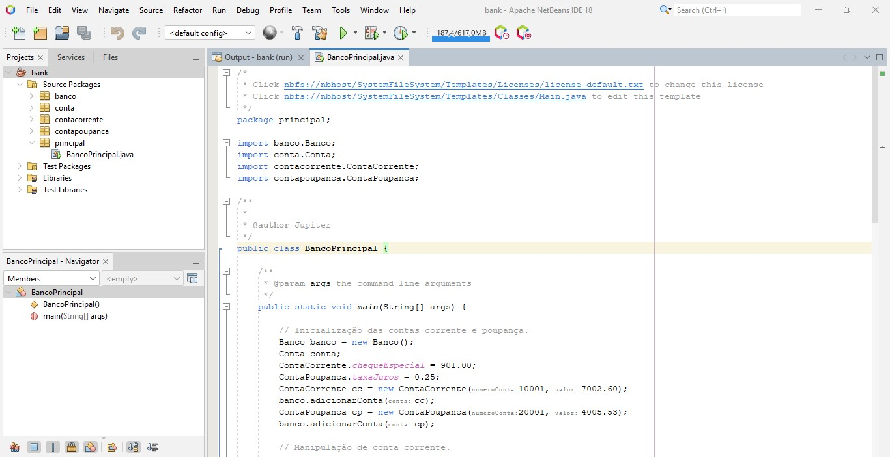
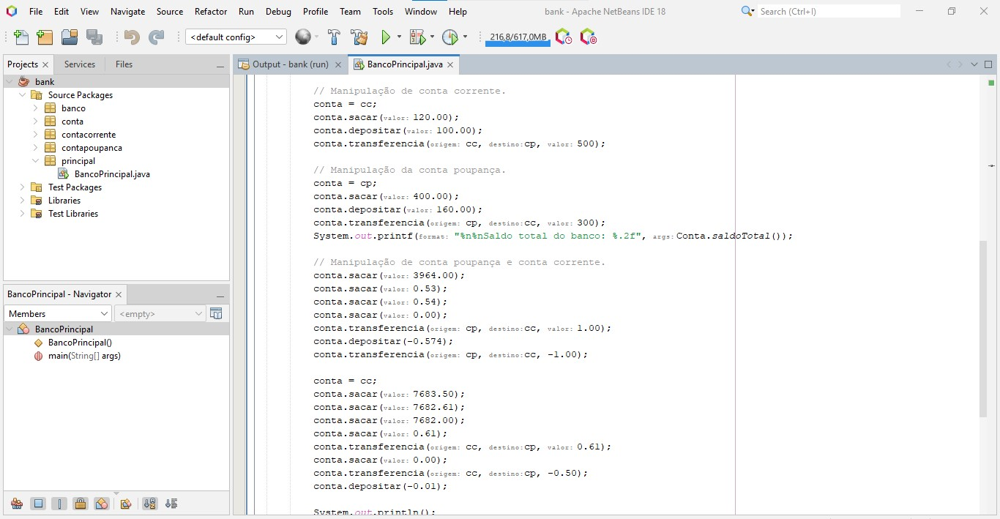
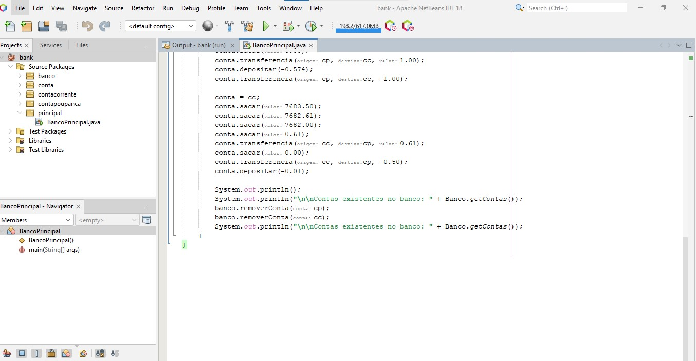
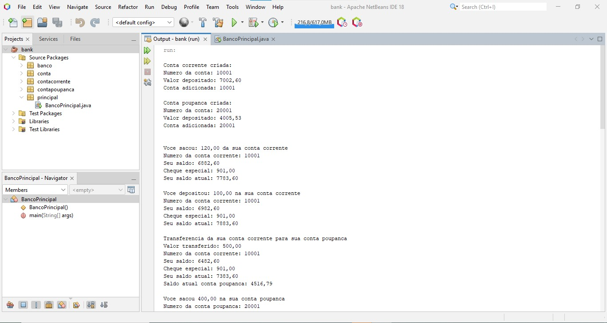
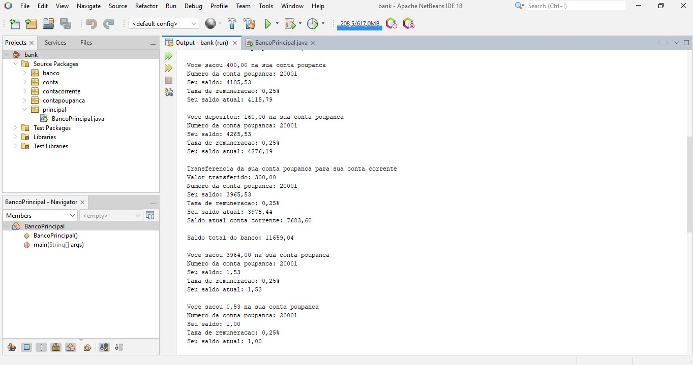
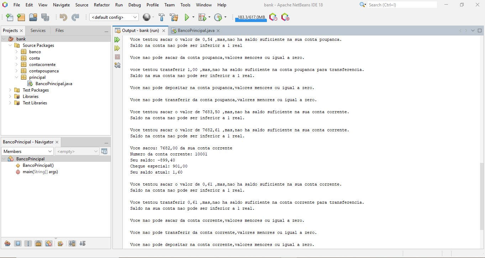
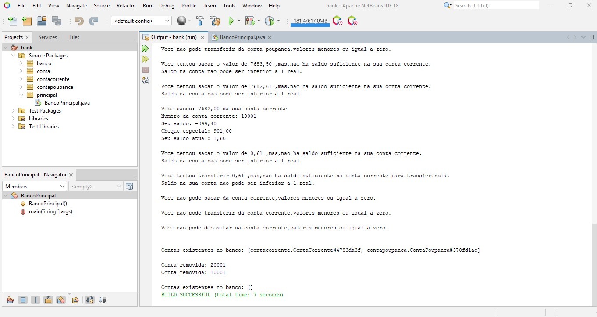

# Projeto Sistema Bancário  
  
  Desenvolver um sistema, onde é necessário lidar com diferentes tipos de contas e transações.  
  O sistema deve fornecer contas correntes,contas poupanças e transações como depósitos,saques e transferências.  
  
- Crie as seguintes classes para representar os diferentes tipos de contas:  
  Conta, ContaCorrente e ContaPoupanca.  
    
- Cada classe deve ter os seguintes atributos:  
  numeroConta, saldo, taxaJuros (para contas poupança, em porcentagem - 2.0, 5.1, 10.5, etc) e chequeEspecial (apenas para contas correntes).  
    
- Implemente uma classe Banco com o seguinte atributo: contas  

- O banco é responsável por adicionar novas contas e remover contas.  
  adicionarConta(Conta conta)
  removerConta(Conta conta)

- Adicione os seguintes métodos nas classes de ContaCorrente e ContaPoupanca para realizar   depósitos,saques,transferências e retornar o saldo atual.  
  depositar(double valor)   
  sacar(double valor)    
  transferencia(Conta contaOrigem, Conta contaDestino, double valor)    
  saldoAtual()  
***
Obs.:  
Implemente um método na classe Conta para calcular o saldoTotal.Para contas poupança,aplique  
a taxa de juros.
O chequeEspecial funciona como uma reserva ao saldo da conta; por exemplo, se o saldo é 100 e  o chequeEspecial é 20, então o retorno de saldoAtual é a soma.    
Contas devem ter o construtor com os parâmetros.    
Considere também a validação de operações,como não permitir saques que ultrapassem o saldo disponível.    
Não é possível transferir,depositar nem sacar valores negativos.    
Utilize conceitos avançados de orientação a objetos,como herança,polimorfismo e encapsulamento.  

### Entradas  
  
    

    
   
    

### Saídas  

      

      

      

      

  
    
  
 