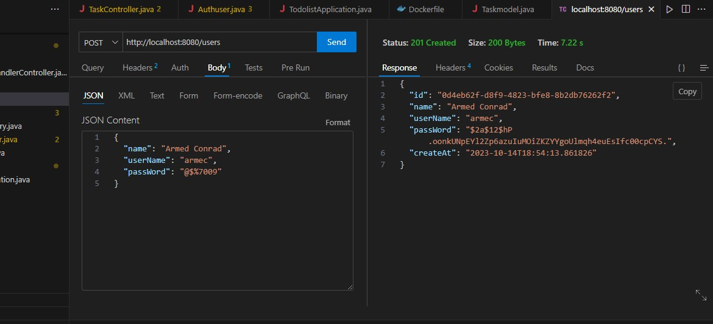
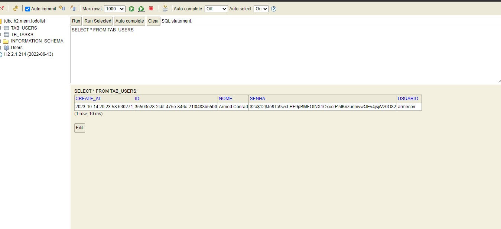
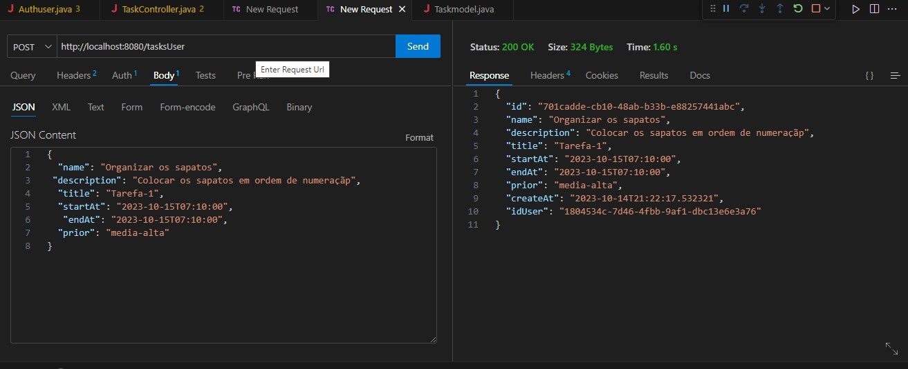
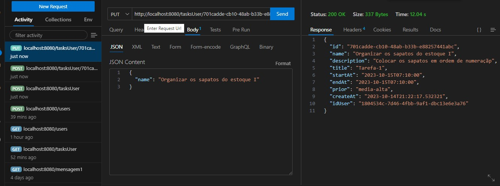
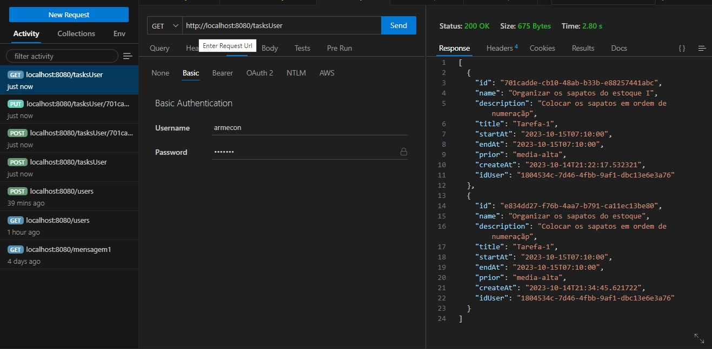
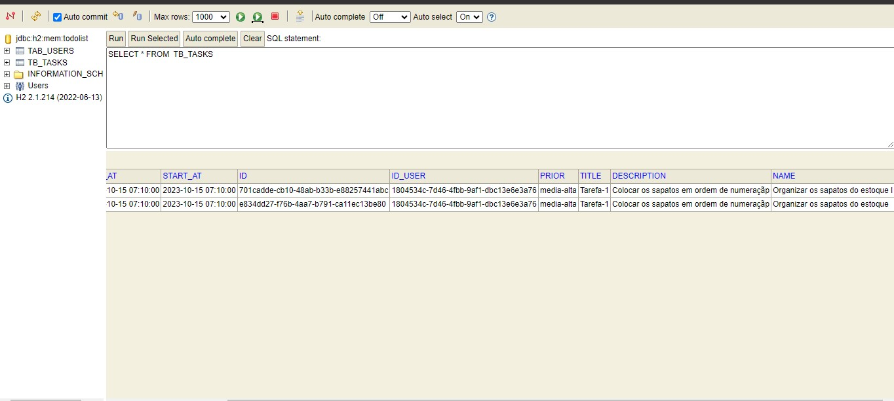
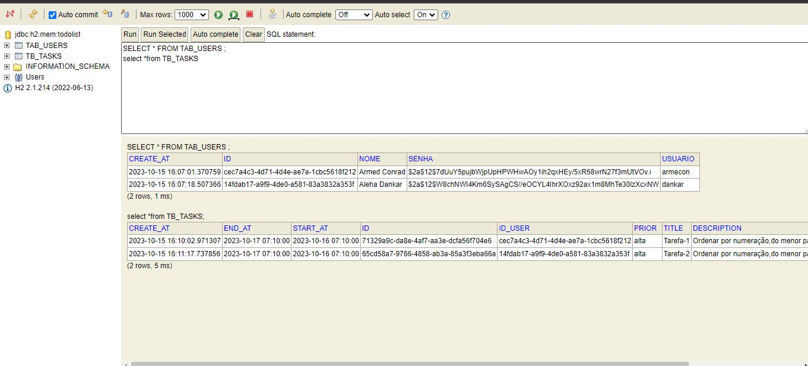

# Todo List    

### Usuário criado    
   
  
### Usuário já existe    
  

### Usuários no banco H2-Base(em memória)   
  

### Tarefa cadastrada    

  
### Tarefa atualizada    
  
  
### Lista com todas tarefas de um usuário   
  
  
### Tarefas no banco H2-Base(em memória)   
 

### Usuário não autorizado a atualizar tarefa  
  

### Tarefas e usuários no banco H2-base(em memória)  
  